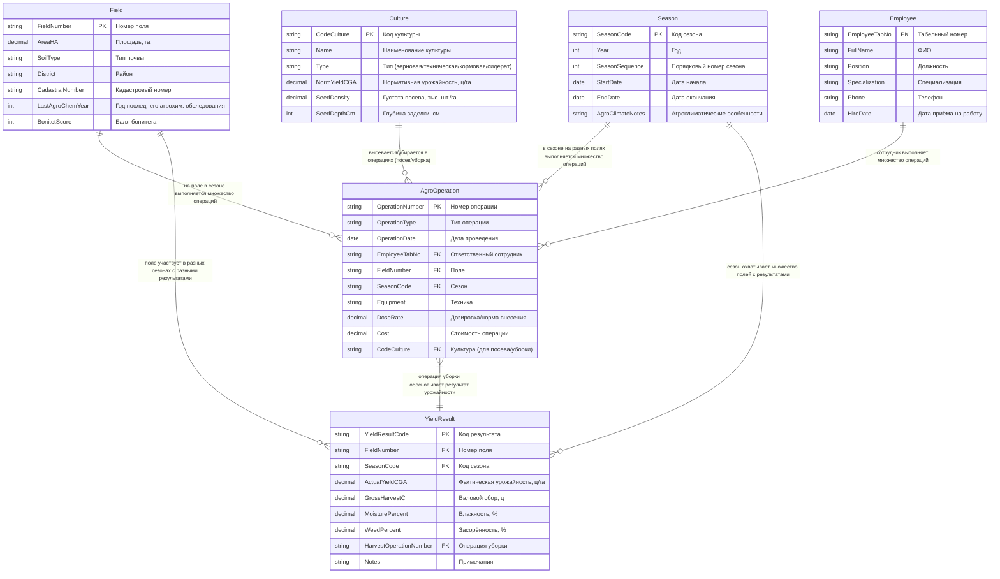

```mermaid
erDiagram
    Culture {
        string CodeCulture PK "Код культуры"
        string Name "Наименование культуры"
        string Type "Тип (зерновая/техническая/кормовая/сидерат)"
        decimal NormYieldCGA "Нормативная урожайность, ц/га"
        decimal SeedDensity "Густота посева, тыс. шт./га"
        int SeedDepthCm "Глубина заделки, см"
    }

    Field {
        string FieldNumber PK "Номер поля"
        decimal AreaHA "Площадь, га"
        string SoilType "Тип почвы"
        string District "Район"
        string CadastralNumber "Кадастровый номер"
        int LastAgroChemYear "Год последнего агрохим. обследования"
        int BonitetScore "Балл бонитета"
    }

    Season {
        string SeasonCode PK "Код сезона"
        int Year "Год"
        int SeasonSequence "Порядковый номер сезона"
        date StartDate "Дата начала"
        date EndDate "Дата окончания"
        string AgroClimateNotes "Агроклиматические особенности"
    }

    Employee {
        string EmployeeTabNo PK "Табельный номер"
        string FullName "ФИО"
        string Position "Должность"
        string Specialization "Специализация"
        string Phone "Телефон"
        date HireDate "Дата приёма на работу"
    }

    AgroOperation {
        string OperationNumber PK "Номер операции"
        string OperationType "Тип операции"
        date OperationDate "Дата проведения"
        string EmployeeTabNo FK "Ответственный сотрудник"
        string FieldNumber FK "Поле"
        string SeasonCode FK "Сезон"
        string Equipment "Техника"
        decimal DoseRate "Дозировка/норма внесения"
        decimal Cost "Стоимость операции"
        string CodeCulture FK "Культура (для посева/уборки)"
    }

    YieldResult {
        string YieldResultCode PK "Код результата"
        string FieldNumber FK "Номер поля"
        string SeasonCode FK "Код сезона"
        decimal ActualYieldCGA "Фактическая урожайность, ц/га"
        decimal GrossHarvestC "Валовой сбор, ц"
        decimal MoisturePercent "Влажность, %"
        decimal WeedPercent "Засорённость, %"
        string HarvestOperationNumber FK "Операция уборки"
        string Notes "Примечания"
    }

    %% Связи
    Culture ||--o{ AgroOperation : "высевается/убирается в операциях (посев/уборка)"
    Field ||--o{ AgroOperation : "на поле в сезоне выполняется множество операций"
    Season ||--o{ AgroOperation : "в сезоне на разных полях выполняется множество операций"
    Employee ||--o{ AgroOperation : "сотрудник выполняет множество операций"
    Field ||--o{ YieldResult : "поле участвует в разных сезонах с разными результатами"
    Season ||--o{ YieldResult : "сезон охватывает множество полей с результатами"
    AgroOperation }|--|| YieldResult : "операция уборки обосновывает результат урожайности"
```
